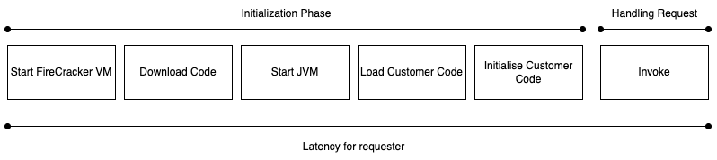
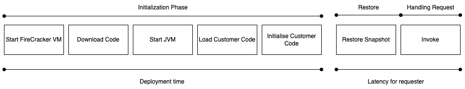

# Lambda SnapStart Priming Guide

## Goal

This guide aims to explain techniques for priming Java applications. It assumes a base understanding of AWS Lambda, Lambda SnapStart, and CRaC.

## Introduction to Lambda SnapStart

Lambda SnapStart is a performance optimization feature. It reduces the amount of time it takes to return a response to the caller when a new execution environment has been created (cold start).
At deployment time, it creates an execution environment and loads your code into it. Once the init phase has completed it takes a snapshot of the entire [FireCracker](https://firecracker-microvm.github.io/) microVM. This includes processes, memory, and any files on the file system. The snapshot is encrypted and placed in persistent storage. Then when future execution environments are required, they can be restored from the snapshot instead of being created from scratch. To further improve the restore time, snapshots are cached.

#### Lambda on-demand phases



#### Lambda SnapStart phases



## What is Priming

Priming is the name given to the process of preparing a Java application for being snapshotted. Priming aims to reduce the time of the first useful work after a restore. A short introduction is included in the AWS Compute blog [Reducing Java cold starts on AWS Lambda functions with SnapStart](https://aws.amazon.com/blogs/compute/reducing-java-cold-starts-on-aws-lambda-functions-with-snapstart/).

Two components contribute to the latency seen by the requester when an invoke happens on a newly restored environment. The first is how fast Lambda can retrieve your snapshot and load it. This is outside of the customer's control. The second is how fast the customer's code can respond to the request. In Java the first time a class is used it has to be compiled from byte code to machine code.

One of the largest contributors to first invoke latency is the JIT compilation of functionality not loaded during the initialization phase. For Java functions the initialization phase will load the class you specified in the handler parameter of your Lambda function. Member variables will be initialized, code in static blocks and the constructor will be executed. Code outside of this won't be compiled.

Priming strategies attempt to compile as much as possible before the snapshot is taken, so that it doesn't need to happen while the requester is waiting for a response. Although I will use Lambda and SnapStart examples, this would most likely be suitable for any use of [project CRaC](https://openjdk.org/projects/crac/).

## Manual Priming

Manual priming uses knowledge of the application functionality to prepare it for peak performance post-restore. This priming strategy uses the `org.crac.Resource` interface to execute the functionality of the Java application in the `beforeCheckpoint` method. Doing this means that those code paths are JIT compiled before the snapshot is taken. Common Lambda use cases include invoking non-mutating methods of @Controllers or other entry points to your application. This is the ideal case, as calling mutating methods can have awkward consequences in downstream systems, even if it's only done as part of a new deployment.

The following example creates a new Spring component that implements `org.crac.Resource`. It registers itself as part of the constructor. The class also uses constructor dependency injection to access the controller. In the `beforeCheckpoint` method it uses the controller to invoke a read operation on a repository. This means that Java loads all the classes in that path and JIT compiles them. This synthetic request is made before the snapshot is taken, outside of any customer request.

```Java
import com.unicorn.store.controller.UnicornController;
import org.crac.Context;
import org.crac.Core;
import org.crac.Resource;
import org.springframework.stereotype.Component;

@Component
public class UnicornPrimingResource implements Resource {

    private final UnicornController unicornController;

    public UnicornPrimingResource(UnicornController unicornController) {
        this.unicornController = unicornController;
        Core.getGlobalContext().register(this);
    }

    @Override
    public void beforeCheckpoint(Context<? extends Resource> context) {
        try {
            unicornController.retrieveUnicorn("123");
        } catch (RuntimeException e) {
            // expected exception when unicorn doesn't exist.
        }
    }

    @Override
    public void afterRestore(Context<? extends Resource> context) {
    }
}
```

Once the application is restored, future operations to this controller endpoint will benefit from not having to be compiled. Although the network connection will have to be recreated, the benefit of priming the application framework, AWS SDK / database driver, and Java networking stack can amount to hundreds of milliseconds. 

### Manual Priming Challenges 

Manually priming isn't always possible, or easy. It assumes that there is a suitable endpoint or entry point to the application that can be invoked with no downstream consequences. The alternative can be to bypass the public API of an application and invoke a non-mutating function of a lower layer such as the AWS SDK. You could for example call the `listTables` API on a DynamoDB client. This will benefit the application because although that functionality might not directly be used in customer interactions, it does still have the benefit of JIT compiling other useful code paths. This can lead to yet more complexity if your Lambda function wouldn't normally call that API endpoint, and now it needs additional IAM permissions just to perform performance optimizations. 

## Automatic Priming

Automatic priming is preparing the application for snapshotting without any downstream effect. You can achieve this by calling `Class.forName(classname, true, software.snapstart.priming.ClassPreLoader.class.getClassLoader())` for each class your application requires. This is the strategy taken in the [Quarkus AWS Lambda extension](https://quarkus.io/guides/aws-lambda-snapstart). 

To find a list of the classes loaded in the operation of your application you can run your application with `-Xlog:class+load=info:classloaded.txt` VM options. 

You will get a file with the following output

```
[0.012s][info][class,load] java.lang.Object source: shared objects file
...
```

Use your favorite editor to create a file with just the fully qualified name on each line.

```
java.lang.Object
java.io.Serializable
```

Now you can create a generic `org.crac.Resource` implementation which reads a list of classes and calls `Class.forName` on each.

From [HandlerWithAutomaticPriming.java](/examples/emf/emf-client-example/src/main/java/software/example/HandlerWithAutomaticPriming.java)

```Java
public void beforeCheckpoint(org.crac.Context<? extends Resource> context) throws Exception {
    ClassPreLoader.preloadClasses(true);
}
```

An implementation of this approach is included in the example [ClassPreLoader.java](/examples/emf/emf-client-example/src/main/java/software/snapstart/priming/ClassPreLoader.java).

## Example Application

I was recently optimizing a Lambda function that used the [AWS EMF client](https://docs.aws.amazon.com/AmazonCloudWatch/latest/monitoring/CloudWatch_Embedded_Metric_Format_Libraries.html). I found that for a trivial use case in on-demand mode it had an init duration of 765ms and a duration of 738ms. Its use of Jackson Databind contributed a lot to this latency. I wanted to prime this function, without creating extra metrics in CloudWatch.

You can find the code I used in the [examples folder](/examples/emf).

| Method                        | Init / Restore Duration | Duration | Total   |
|-------------------------------|-------------------------|----------|---------|
| On-demand                     | 765ms                   | 738ms    | 1,377ms |
| SnapStart / no priming        | 581ms                   | 708ms    | 1,289ms |
| SnapStart + manual priming    | 627ms                   | 652ms    | 1,279ms |
| SnapStart + automatic priming | 589ms                   | 404ms    | 993ms   |

_This wasn't a benchmark, just a single invoke, measured with 512MB memory._

## Conclusion 

Both strategies unfortunately involve additional work and complexity as a trade-off to improve first invoke latency. Automatic priming allows you to prime your application without calling methods that have an effect outside of the application. A list of classes can be made in a development environment and either checked into a project or created as part of the build process. If this isn't an issue then manually priming is a simpler approach.

Less work would be required by the application developer if library and framework developers added support for priming.

## Improvements to add

- [x] Example data
- [x] Include imports in code examples
- [x] Intro to the benefits of snapshotting
- [x] Diagram of the snapshot lifecycle
- [x] Full project examples which can be deployed
- [ ] Examples of priming runs in CW
- [ ] Diagrams to show when and how priming interacts with the application
- [ ] Possible side effects of priming
- [ ] DNS
- [ ] Recreating connections vs waiting for retry logic
- [ ] Pseudorandomness / Stale creds
- [ ] Link to Java serverless container when discussing microservices which benefit more from priming
